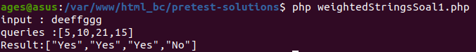
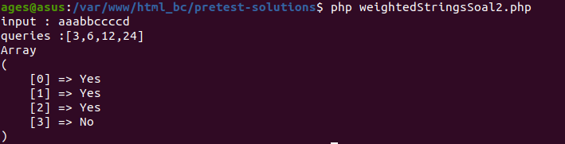
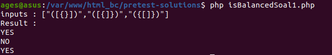
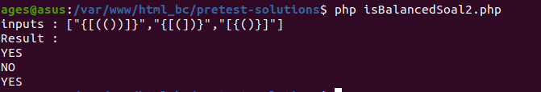
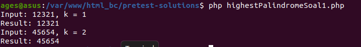
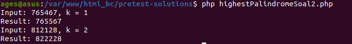

# Nama Repository: problem-solving-pretest

## Deskripsi
Repository ini berisi solusi untuk problem solving pretest yang mencakup tiga masalah utama:
1. Weighted Strings
2. Balanced Bracket
3. Highest Palindrome

## Struktur Repository
- `weightedStringsSoal1.php`

- `weightedStringsSoal2.php`

- `isBalancedSoal1.php`

- `isBalancedSoal2.php`

- `highestPalindromeSoal1.php`

- `highestPalindromeSoal2.php`

## Cara Menggunakan
1. Clone repository ini.
2. Jalankan masing-masing file kode PHP menggunakan command line atau server PHP.
3. Periksa hasil output pada folder `screenshots`.

## Ringkasan
- **Soal Weighted Strings:** Implementasi fungsi untuk menghitung bobot substring dan mengecek query.
- **Soal Balanced Bracket:** Implementasi fungsi untuk memeriksa keseimbangan tanda kurung.
- **Soal Highest Palindrome:** Implementasi fungsi rekursif untuk membuat palindrome tertinggi dengan k penggantian karakter.

## Penyelesaian Kompleksitas
- **Balanced Bracket:** Kompleksitas waktu adalah O(n), di mana n adalah panjang string karena kita hanya perlu memeriksa setiap karakter sekali.
- **Highest Palindrome:** Kompleksitas waktu juga adalah O(n) karena kita memeriksa setiap karakter dari awal hingga akhir string.